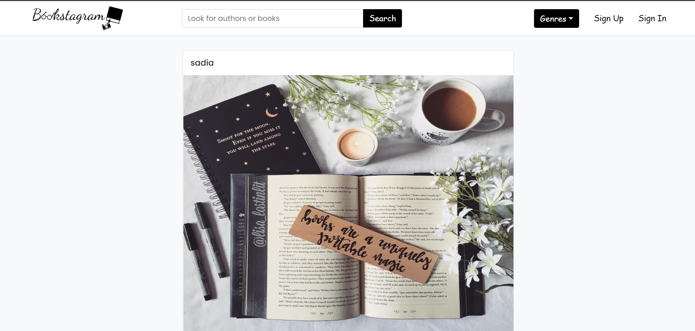

# Bookstagram
A social media website for book and book art lovers. 
Visitors of the website can read various book reviews and take inspiration for book art.
Users can post book reviews along with a picture of the book which expresses their own artistic style.
1. First ordered list item
2. Another item
⋅⋅* Unordered sub-list. 
1. Actual numbers don't matter, just that it's a number
⋅⋅1. Ordered sub-list
4. And another item.

## Functionality

1. Non-registered Users
⋅⋅* Users who don't have an account can browse the website and see the posts made by the registered users.
⋅⋅* They can use the search system to lookup particular books or authors.
⋅⋅* They can view the comments made by registered users.
⋅⋅* They cannot post their own content.
⋅⋅* They cannot like or comment on a post.

2. Registered Users
•	Users with an account can post whatever content they want.
•	During posting, users are required to fill out the "Book Info" form first.
•	They can like and comment on other users' posts.
•	They can edit their email and password from "Settings" option.
•	They can deactivate their account.

3. Search system
Users (both registered and non-registered) can utilize the search functionality in two ways. 
•	They can search for authors and books by using the search bar. 
•	By using the dropdown button, users can select from a list of genres which particular genre of book posts they want to see.

## Technologies Used

Technologies used in this project are HTML, CSS, vanilla JavaScript, Bootstrap, PHP and mySqli.

## Link

- [Live Site URL](http://bookstagram.epizy.com)

## Screenshot

